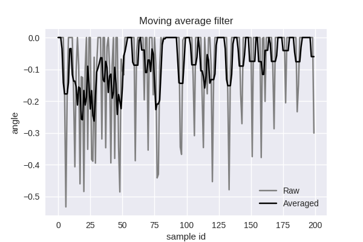
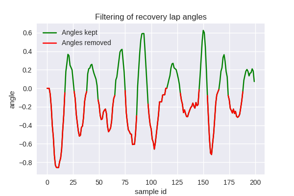
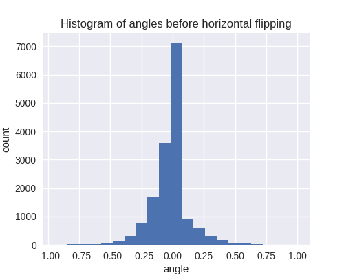
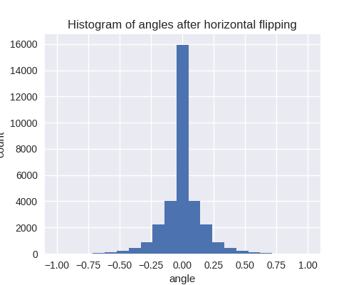
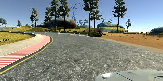
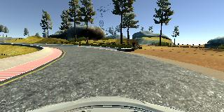
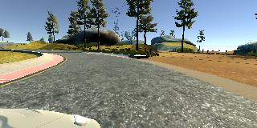
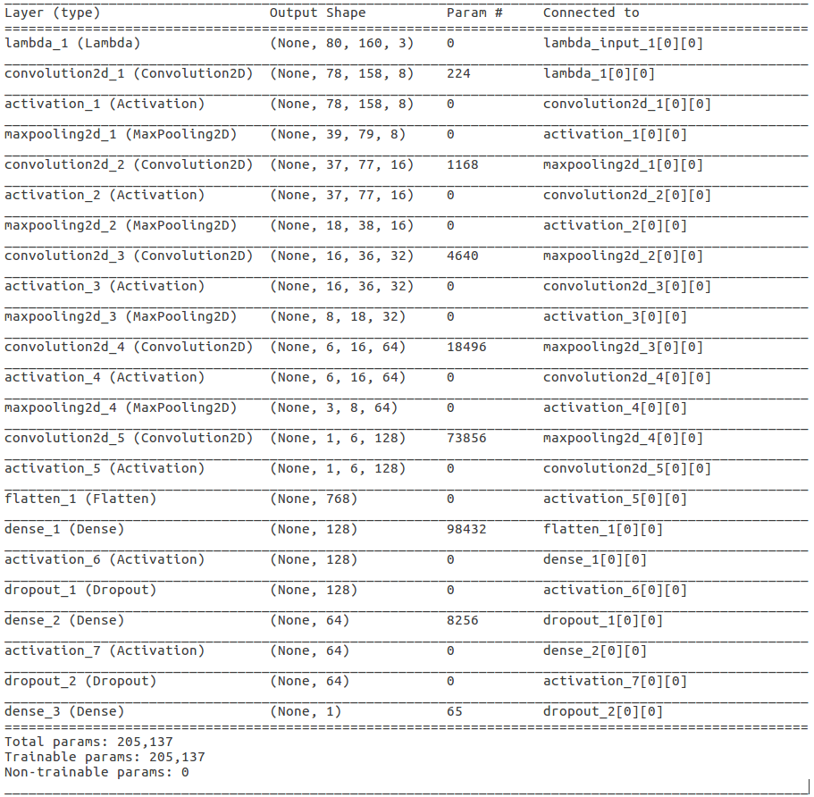
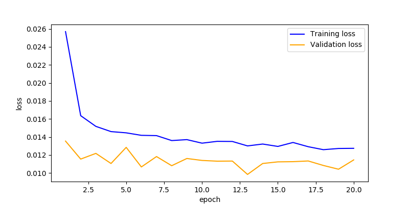

# Project: Behavioral Cloning

### Training data and data augmentation
As the first part of the Behavioral Cloning project, I collected a large amount of training data with the simulator.
I cooperated with a colleague (Peter Christiansen), where we drove two normal laps and two recovery laps (one in the right side and one in the left) each. Additionally, I included the sample data for track 1 provided by udacity.
In total, 15852 samples (corresponding images and angles) were collected.

Since we used the keyboard-controlled version of the simulator, our steering angles were quite noisy and with a lot of peaks. I therefore used a moving average filter with size=5 and filter values 1/5. The figure below illustrates the resulting angles.

When processing recovery data, I made sure not to include any steering angles turning the car outwards (away from the center of the road). This was achieved by separating recordings of left-side recoveries and right-side recoveries. A left-side recovery lap was driven by zigzagging between the center and the left-most side of the road.
Subsequently, I could then filter out all negative steering angles, such that I included only angles pointing towards the center of the road. The figure below illustrates steering angles from such a lap, where the red part is filtered out, whereas the green part is kept. Note that some negative-value parts of the lines are actually green in the figure. This is an artefact caused by plotted discrete values continously.

Since the lap consisted almost entirely of left turns, I augmented the training data by flipping images horizontally and negating the sign of the corresponding angles. The two figures below illustrate histograms of angles before and after this augmentation step. Note that the number of data examples doubles with this augmentation step.

 

Finally, further data augmentation is achieved by including not only the center camera, but also the left and right cameras of the simulator car.
These cameras point a bit off center and therefore simulate the car driving in a different direction than it actually does.
I included these cameras by associating an adjusted steering angle to each image.
An image from the left camera is thus assigned a steering angle of "left_angle = angle+adj" where, by trial-and-error, I set adj=0.3.
Similarly, for the right camera, "right_angle = angle-adj".
The figures below illustrate an example from a run with the left, center, and right cameras and corresponding corrected steering angles.

left_angle = -0.6850234+0.3 = -0.3850234

center_angle = -0.6850234

right_angle = -0.6850234-0.3 = -0.9850234

### Code and structure
Two main python scripts have been used to generate data and train the model.
"generate_dataset.py" reads a directory consisting of a number of subdirectories with different training runs. The script applies the moving average filter and filters recovery lap angles as described above. It then generates a combined csv-file with a total of 15852 samples.

"model.py" defines the network architecture and trains and tests the model.
First, a python generator, "myGenerator", is defined, that loads data from the combined csv-file into batches on-the-fly. In this way, only batch_size images are loaded into memory at a time. The generator also performs data augmentation by randomly flipping images horizontally (and flipping signs of steering angles accordingly) and choosing randomly between the three cameras on the car.

### Model Architecture
My network architecture consists of 13 layers: 1 normalization, 5 convolutional, 4 pooling, and 3 fully connected. The architecture is inspired by the VGG network. The convolutional kernels are all 3x3 and max-pooling with 2x2, making the architecture relatively simple. All activation functions are rectified linear units (relu). The figure below illustrates a summary of the model generated with keras.

The normalization layer (lambda_1) provides per-sample normalization by scaling the input of the three channels (RGB) to [-1:1].
This is followed by 4 pairs of convolution, relu, and max-pooling, gradually decreasing the width and height of feature maps, while increasing their depths (3-->8-->16-->32-->64).
A final convolutional layer generates a feature map of (1,6,128), which is flattened and fed to the first fully connected layer.

The fully connected layers gradually decrease the number of neurons from 128-->64-->1, where the last neuron outputs the predicted steering angle.

In order to introduce regularization, I have added two dropout layers after the relu activations of the first two fully connected layers.
I experienced that introducing dropout effectively helped avoid overshooting of the steering angles (zigzagging) when testing with the simulator. However, a too high dropout fraction resulted in too small steering angles, such that the car could not make hard turns.
I found that a dropout fraction of 0.4 was a good compromise.

In total, the model consists of ~205.000 trainable parameters.
This is a bit less than the model proposed by the Nvidia paper "End to End Learning for Self-Driving Cars", but certainly enough to capture the limited variation present in the simulated dataset.

I trained the model on an NVIDIA Titan X Pascal, whereas I tested the model on a laptop with a Quadro K2100M.

### Training Strategy
The collected dataset is first shuffled and then divided into training, validation, and test data with the following distribution:

- Train: 80%
- Validation: 10%
- Test: 10%

During training, the validation loss is used to prevent overfitting.
Test data is used to quantize the performance of the model.
However, the most important test, of course, is evaluating the model in the simulator.
A low loss on the test data does not guarantee a good run in the simulator.
If the model always predicts a steering angle of 0, for instance, the test loss might be low, because most of the steering angles in the dataset are close to 0. In the simulator, however, this would immediately result in the car driving off the track.

When training the model, I used the Adam optimizer with default parameters.
As loss function, I used mean squared error, since this is suitable for capturing the continuous differences present in a regression problem, and handles negative and positive steering angles in the same manner.

I used the "fit_generator" function in keras using the same python generator for both training and validation data.

For training, the following hyperparameters were used:

- Number of epochs: 20
- Batch size: 64
- Initial learning rate: 0.001 (default for Adam optimizer)

Initially, I ran the model with fewer epochs. But after introducing dropout, I experienced that more epochs were needed.
A batch size of 64 was chosen, as this converged relatively fast without resulting in high jumps in loss.

The figure below shows the training and validation loss across the 20 epochs.
Interestingly, the training loss is larger than the validation loss for all epochs.
This is due to the fact that dropout is only applied during training, and not during evaluation.
However, I have used the validation loss to ensure that I am not overfitting the model.

### Test and simulation
When testing on the test set, I achieved a loss of 0.0111, which is roughly the same as the validation set.
This means that I have not overfitted the validation set, although I have used it a number of times to adjust network parameters manually.

The most interesting test is performed in the simulator, where the car manages to stay on the road on the entire track.
A video of a track is available [here](https://youtu.be/BXbp5hLWaKI)